---
# Front matter
lang: ru-Ru
title: "Лабораторная работа №1"
subtitle: "Установка дистрибутива Rocky"
author: "Юхнин Илья Андреевич"

# Formatting
toc-title: "Содержание"
toc: true # Table of contents
toc_depth: 2
lof: true # List of figures
lot: true # List of tables
fontsize: 12pt
linestretch: 1.5
papersize: a4paper
documentclass: scrreprt
polyglossia-lang: russian
polyglossia-otherlangs: english
mainfont: PT Serif
romanfont: PT Serif
sansfont: PT Sans
monofont: PT Mono
mainfontoptions: Ligatures=TeX
romanfontoptions: Ligatures=TeX
sansfontoptions: Ligatures=TeX,Scale=MatchLowercase
monofontoptions: Scale=MatchLowercase
indent: true
pdf-engine: xelatex
header-includes:
  - \linepenalty=10 # the penalty added to the badness of each line within a paragraph (no associated penalty node) Increasing the value makes tex try to have fewer lines in the paragraph.
  - \interlinepenalty=0 # value of the penalty (node) added after each line of a paragraph.
  - \hyphenpenalty=50 # the penalty for line breaking at an automatically inserted hyphen
  - \exhyphenpenalty=50 # the penalty for line breaking at an explicit hyphen
  - \binoppenalty=700 # the penalty for breaking a line at a binary operator
  - \relpenalty=500 # the penalty for breaking a line at a relation
  - \clubpenalty=150 # extra penalty for breaking after first line of a paragraph
  - \widowpenalty=150 # extra penalty for breaking before last line of a paragraph
  - \displaywidowpenalty=50 # extra penalty for breaking before last line before a display math
  - \brokenpenalty=100 # extra penalty for page breaking after a hyphenated line
  - \predisplaypenalty=10000 # penalty for breaking before a display
  - \postdisplaypenalty=0 # penalty for breaking after a display
  - \floatingpenalty = 20000 # penalty for splitting an insertion (can only be split footnote in standard LaTeX)
  - \raggedbottom # or \flushbottom
  - \usepackage{float} # keep figures where there are in the text
  - \floatplacement{figure}{H} # keep figures where there are in the text
---

# Цель работы

Приобретение практических навыков установки операционной системы Rocky Linux на виртуальную машину и настройка минимально необходимого окружения для дальнейшей работы.

# Задание

Установить дистрибутив Rocky Linux на виртуальную машину.

# Теоретическое введение

Для выполнения данной лабораторной нет специальной теории. Необходимы общие знания в области компьютерных наук.

# Выполнение лабораторной работы

Создаем виртуальную машину в VirtualBox. 

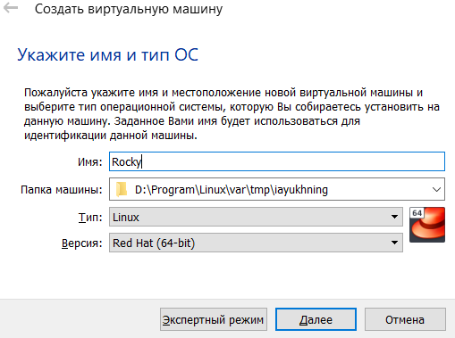

Указываем объем оперативной памяти, выделенный виртуальной машине.

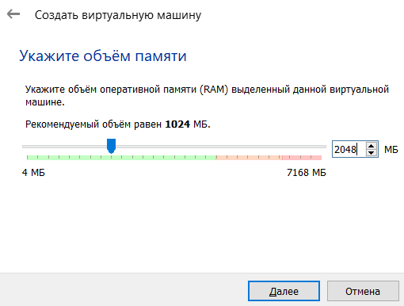

Создаем новый динамический виртуальный жесткий диск типа VDI и задаем его размер.

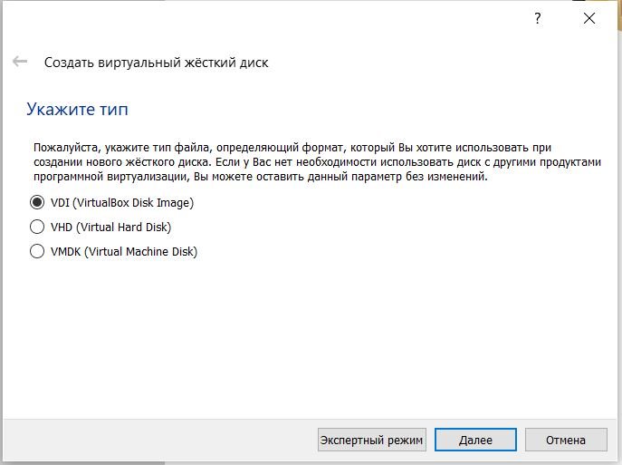

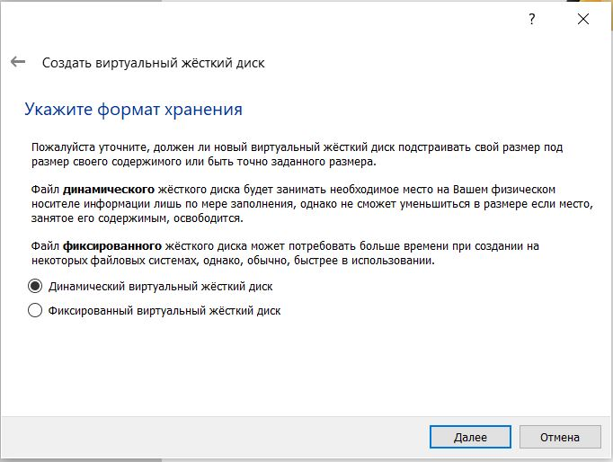

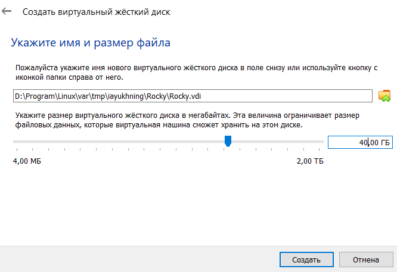

В VirtualBox  добавляем новый привод оптических дисков, где выбираем заранее скачанный образ выбранной операционной системы.

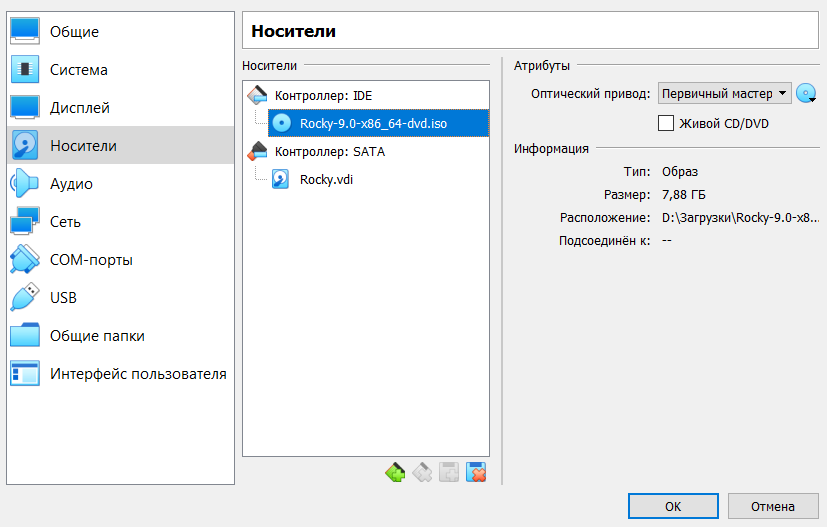

После этого запускаем виртуальную машину и начинаем установку ОС.

Настройка параметров установки

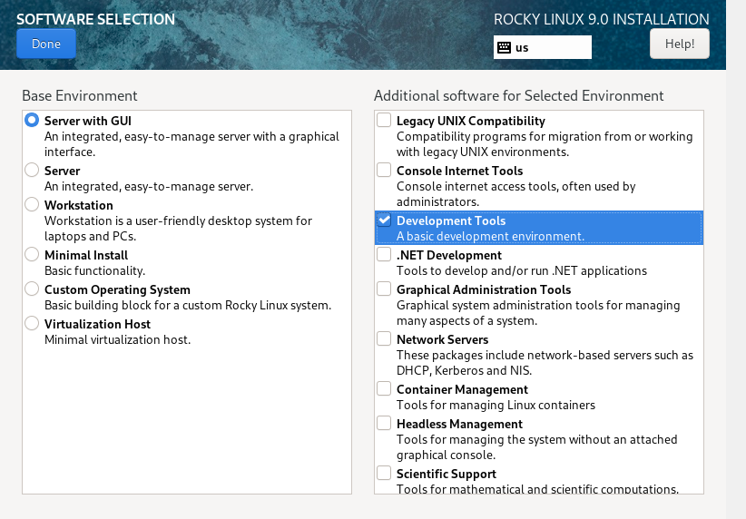

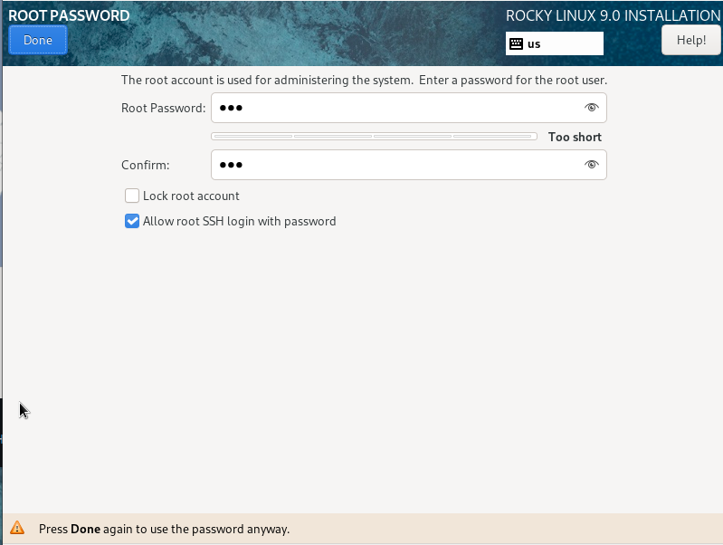

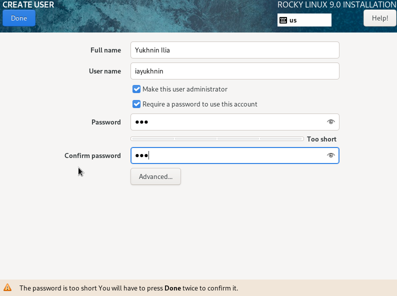

После выполнения данных шагов мы попадаем на рабочий стол нашей виртуальной машины. 

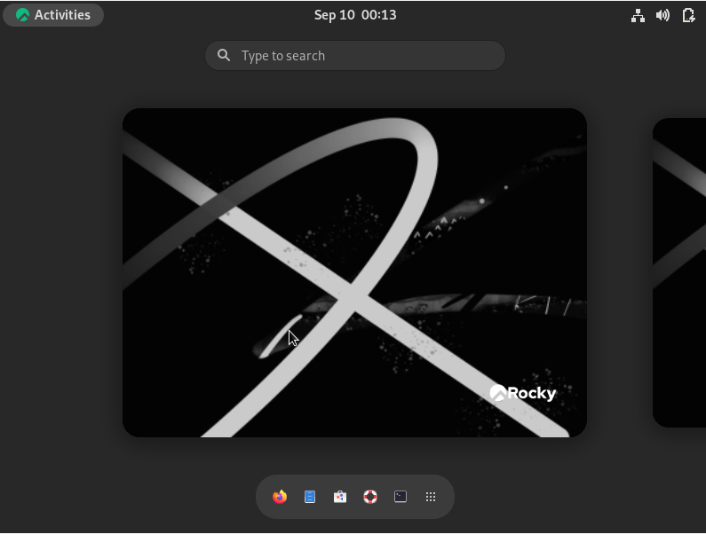

Подключить образ диска дополнительной гостевой ОС.

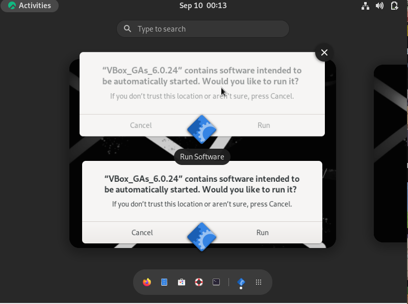

Процесс подключения.

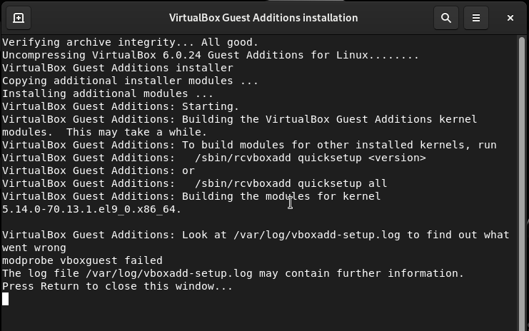

## Домашнее задание

Получите следующую информацию:
1. Версия ядра Linux (Linux version)
2. Частота процессора (Detected Mhz processor)
3. Модель процессора (CPU0)
4. Объем доступной оперативной памяти (Memory available)
5. Тип обнаруженного гипервизора (Hypervisor detected)
6. Тип файловой системы корневого раздела - XFS
7. Последовательность монтирования файловых систем

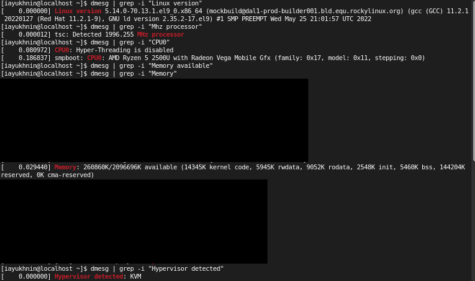

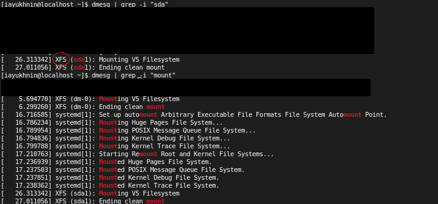

# Выводы

В ходе выполнения данной лабораторной работы я приобрел  навыки установки операционной системы Rocky Linux на виртуальную машину.

# Список литературы

- <code>[Кулябов Д. С., Королькова А. В., Геворкян М. Н Лабораторная работа №1](https://esystem.rudn.ru/mod/folder/view.php?id=892013)</code>