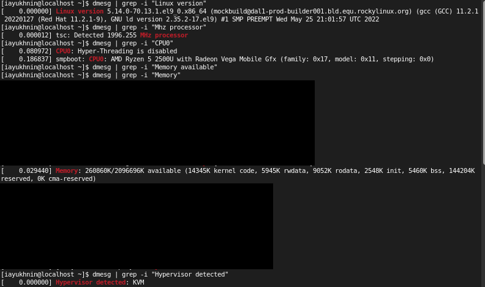
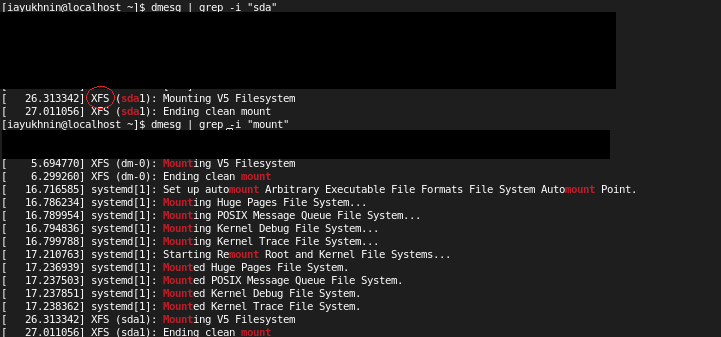
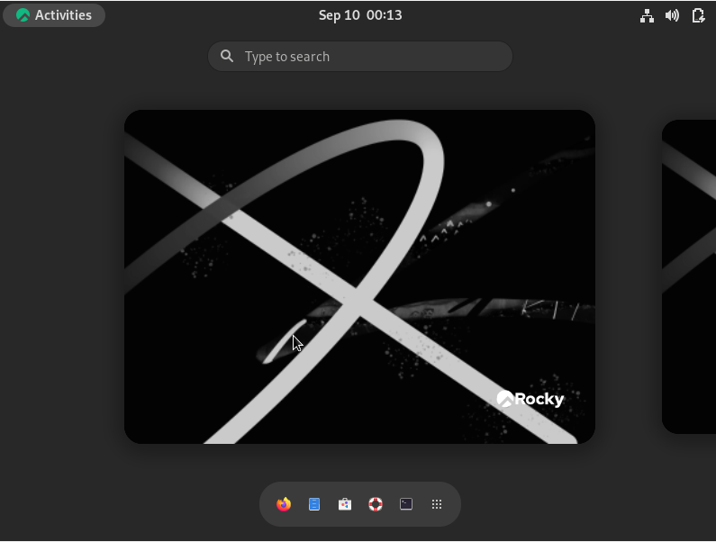

---
## Front matter
lang: ru-RU
title: Лабораторная работа №1
author: Юхнин Илья Андреевич
documentclass: article
papersize: a4
toc: false
slide_level: 2
aspectratio: 20
section-titles: true
##Fonts
fontsize: 12pt
mainfont: PT Serif
romanfont: PT Serif
sansfont: PT Sans
monofont: PT Mono
mainfontoptions: Ligatures=TeX
romanfontoptions: Ligatures=TeX
sansfontoptions: Ligatures=TeX,Scale=MatchLowercase
monofontoptions: Scale=MatchLowercase,Scale=0.9
---

# 
Лабораторная работа №1

**Автор: Юхнин Илья Андреевич**

**Группа: НКНбд-01-19**

## Прагматика выполнения

- Получение знаний об установке ОС Rocky Linux, созданный Rocky Enterprise Software Foundation и вдохновленный изобретателем CentOS Грегори Куртцером, является совместимым производным бесплатного программного обеспечения Red Hat Enterprise Linux 8.
  

  

## Цель выполнения лабораторной работы

- Приобретение практических навыков установки операционной системы на виртуальную машину, настройки минимально необходимых для дальнейшей работы сервисов.

- Создание отчёта по лабораторной работе с загрузкой на GitHub в формате Markdown

- Получение знаний

    

## Задачи

- Установить ОС Rocky Linux

- Вывести различную информацию о системе

## Результат лабораторной работы

- Информация о системе:

- Рабочий стол установленной ОС

​    

 Спасибо за внимание!

