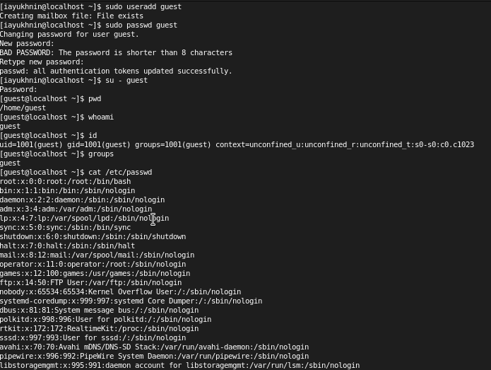
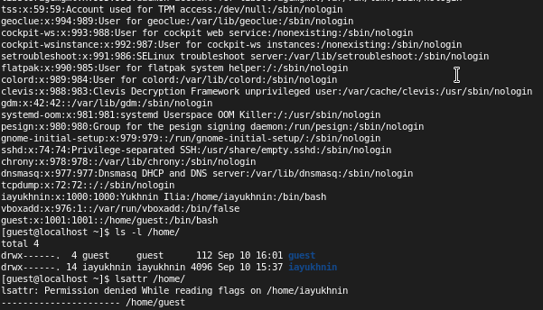
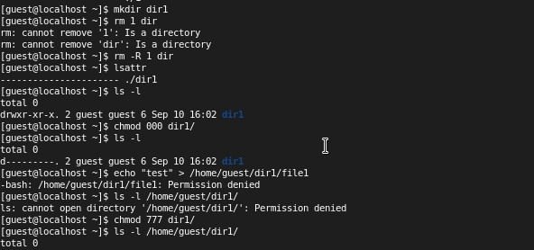
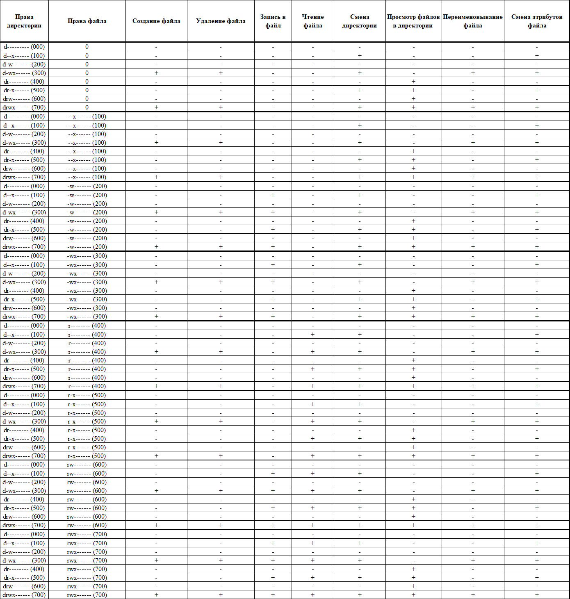

---
# Front matter
lang: ru-Ru
title: "Лабораторная работа №2"
subtitle: "Дискреционное разграничение прав в Linux. Основные атрибуты"
author: "Юхнин Илья Андреевич"

# Formatting
toc-title: "Содержание"
toc: true # Table of contents
toc_depth: 2
lof: true # List of figures
lot: true # List of tables
fontsize: 12pt
linestretch: 1.5
papersize: a4paper
documentclass: scrreprt
polyglossia-lang: russian
polyglossia-otherlangs: english
mainfont: PT Serif
romanfont: PT Serif
sansfont: PT Sans
monofont: PT Mono
mainfontoptions: Ligatures=TeX
romanfontoptions: Ligatures=TeX
sansfontoptions: Ligatures=TeX,Scale=MatchLowercase
monofontoptions: Scale=MatchLowercase
indent: true
pdf-engine: xelatex
header-includes:
  - \linepenalty=10 # the penalty added to the badness of each line within a paragraph (no associated penalty node) Increasing the value makes tex try to have fewer lines in the paragraph.
  - \interlinepenalty=0 # value of the penalty (node) added after each line of a paragraph.
  - \hyphenpenalty=50 # the penalty for line breaking at an automatically inserted hyphen
  - \exhyphenpenalty=50 # the penalty for line breaking at an explicit hyphen
  - \binoppenalty=700 # the penalty for breaking a line at a binary operator
  - \relpenalty=500 # the penalty for breaking a line at a relation
  - \clubpenalty=150 # extra penalty for breaking after first line of a paragraph
  - \widowpenalty=150 # extra penalty for breaking before last line of a paragraph
  - \displaywidowpenalty=50 # extra penalty for breaking before last line before a display math
  - \brokenpenalty=100 # extra penalty for page breaking after a hyphenated line
  - \predisplaypenalty=10000 # penalty for breaking before a display
  - \postdisplaypenalty=0 # penalty for breaking after a display
  - \floatingpenalty = 20000 # penalty for splitting an insertion (can only be split footnote in standard LaTeX)
  - \raggedbottom # or \flushbottom
  - \usepackage{float} # keep figures where there are in the text
  - \floatplacement{figure}{H} # keep figures where there are in the text
---

# Цель работы

Получение практических навыков работы в консоли с атрибутами файлов, закрепление теоретических основ дискреционного разграничения доступа в современных системах с открытым кодом на базе ОС Linux

# Задание

Выполнить все пункты работы, занося ответы на поставленные вопросы и замечания в отчёт.

# Выполнение лабораторной работы

1. В установленной при выполнении предыдущей лабораторной работы
операционной системе создайте учётную запись пользователя guest
2. Задайте пароль для пользователя guest
3. Войдите в систему от имени пользователя guest.
4. Определите директорию, в которой вы находитесь, командой pwd. Сравните её с приглашением командной строки. Определите, является ли она вашей домашней директорией? Если нет, зайдите в домашнюю директорию. - Командная строка пишет, что я в "~" - домашнем каталоге. Нахожусь в домашней директории пользователя guest, в данный момент работаю под ней, значит да
5. Уточните имя вашего пользователя командой whoami.
6. Уточните имя вашего пользователя, его группу, а также группы, куда входит пользователь, командой id. Выведенные значения uid, gid и др. запомните. Сравните вывод id с выводом команды groups. - groups выводит название группы в которой находится пользователь, а id выводит значения в виде цифр и скобках букв, к которым принадлежит пользователь 
7. Сравните полученную информацию об имени пользователя с данными,
    выводимыми в приглашении командной строки. - При создании пользователя без дополнительных флагов, ему присваивается uid, gid, groups с его именем
8. Просмотрите файл /etc/passwd
Найдите в нём свою учётную запись. Определите uid пользователя.
Определите gid пользователя. Сравните найденные значения с полученными в предыдущих пунктах. - 1001 и 1001 точно такие же как при выводе id
9. Определите существующие в системе директории
    Удалось ли вам получить список поддиректорий директории /home? Ка-
    кие права установлены на директориях? - Да, rwx - все права для владельца директорией и никаких для группы, в которой состоит владелец, и гостей
10. Проверьте, какие расширенные атрибуты установлены на поддиректориях, находящихся в директории /home
Удалось ли вам увидеть расширенные атрибуты директории?
Удалось ли вам увидеть расширенные атрибуты директорий других
пользователей? - Для guest домашнего каталога да, для другого нет, доступ запрещен
11. Создайте в домашней директории поддиректорию dir1
    Определите командами ls -l и lsattr, какие права доступа и расши-
    ренные атрибуты были выставлены на директорию dir1. - Все права для владельца, права исполнения для группы и чтение, исполнение для всех. Расширенных атрибутов на папке нет
12. Снимите с директории dir1 все атрибуты и проверьте с её помощью правильность выполнения команды ls -l
13. Попытайтесь создать в директории dir1 файл file1 командой
echo "test" > /home/guest/dir1/file1
Объясните, почему вы получили отказ в выполнении операции по созданию файла?
Оцените, как сообщение об ошибке отразилось на создании файла? Проверьте действительно ли файл file1 не находится внутри директории dir1. - После предыдущего пункта все возможные права были отключены, в итоге работать с каталогом нельзя, нет доступа. Файл не создался, вернем права и проверим, файла нет.

14. Заполните таблицу «Установленные права и разрешённые действия», выполняя действия от имени владельца директории (файлов), определив опытным путём, какие операции разрешены, а какие нет.
    Если операция разрешена, занесите в таблицу знак «+», если не разрешена, знак «-».
    
    

15. На основании заполненной таблицы определите те или иные минимально необходимые права для выполнения операций внутри директории dir1, заполните следующую таблицу

    | Операция               | Минимальные права на директорию | Минимальные права на файл при доступе в директорию (300) и (700) |
    | ---------------------- | ------------------------------- | ------------------------------------------------------------ |
    | Создание файла         | (300)                           | (000)                                                        |
    | Удаление файла         | (300)                           | (000)                                                        |
    | Чтение файла           | (100)                           | (400)                                                        |
    | Запись в файл          | (100)                           | (200)                                                        |
    | Переименование файла   | (300)                           | (000)                                                        |
    | Создание поддиректории | (300)                           | (000)                                                        |
    | Удаление поддиректории | (300)                           | (000)                                                        |

    

# Выводы

В ходе выполнения данной лабораторной работы я приобрел навыки дискреционного разграничения прав в Linux.

# Список литературы

- <code>[Лабораторная работа №2](https://esystem.rudn.ru/mod/resource/view.php?id=892016)</code>