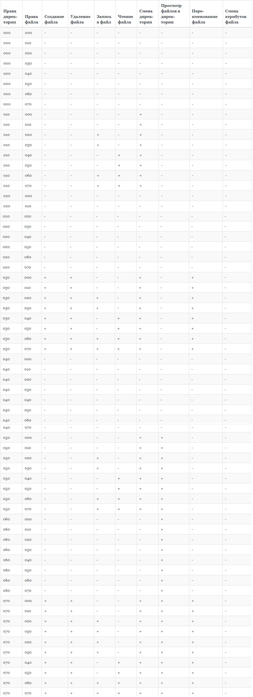

---
# Front matter
lang: ru-Ru
title: "Лабораторная работа №3"
subtitle: "Дискреционное разграничение прав в Linux. Два пользователя"
author: "Юхнин Илья Андреевич"

# Formatting
toc-title: "Содержание"
toc: true # Table of contents
toc_depth: 2
lof: true # List of figures
lot: true # List of tables
fontsize: 12pt
linestretch: 1.5
papersize: a4paper
documentclass: scrreprt
polyglossia-lang: russian
polyglossia-otherlangs: english
mainfont: PT Serif
romanfont: PT Serif
sansfont: PT Sans
monofont: PT Mono
mainfontoptions: Ligatures=TeX
romanfontoptions: Ligatures=TeX
sansfontoptions: Ligatures=TeX,Scale=MatchLowercase
monofontoptions: Scale=MatchLowercase
indent: true
pdf-engine: xelatex
header-includes:
  - \linepenalty=10 # the penalty added to the badness of each line within a paragraph (no associated penalty node) Increasing the value makes tex try to have fewer lines in the paragraph.
  - \interlinepenalty=0 # value of the penalty (node) added after each line of a paragraph.
  - \hyphenpenalty=50 # the penalty for line breaking at an automatically inserted hyphen
  - \exhyphenpenalty=50 # the penalty for line breaking at an explicit hyphen
  - \binoppenalty=700 # the penalty for breaking a line at a binary operator
  - \relpenalty=500 # the penalty for breaking a line at a relation
  - \clubpenalty=150 # extra penalty for breaking after first line of a paragraph
  - \widowpenalty=150 # extra penalty for breaking before last line of a paragraph
  - \displaywidowpenalty=50 # extra penalty for breaking before last line before a display math
  - \brokenpenalty=100 # extra penalty for page breaking after a hyphenated line
  - \predisplaypenalty=10000 # penalty for breaking before a display
  - \postdisplaypenalty=0 # penalty for breaking after a display
  - \floatingpenalty = 20000 # penalty for splitting an insertion (can only be split footnote in standard LaTeX)
  - \raggedbottom # or \flushbottom
  - \usepackage{float} # keep figures where there are in the text
  - \floatplacement{figure}{H} # keep figures where there are in the text
---

# Цель работы

Получение практических навыков работы в консоли с атрибутами фай-
лов для групп пользователей

# Задание

Выполнить все пункты работы, занося ответы на поставленные вопросы и замечания в отчёт.

# Теоретическое введение

Для выполнения данной лабораторной нет специальной теории. Необходимы общие знания в области компьютерных наук.

# Выполнение лабораторной работы

1. В установленной операционной системе создайте учётную запись пользователя guest 
2. Задайте пароль для пользователя guest
3. Аналогично создайте второго пользователя guest2.
4. Добавьте пользователя guest2 в группу guest
5. Осуществите вход в систему от двух пользователей на двух разных консолях
6. Для обоих пользователей командой pwd определите директорию, в которой вы находитесь. Сравните её с приглашениями командной строки.
7. Уточните имя вашего пользователя, его группу, кто входит в неё и к каким группам принадлежит он сам. Определите командами groups guest и groups guest2, в какие группы входят пользователи guest и guest2. Сравните вывод команды groups с выводом команд
id -Gn и id -G.
8. Сравните полученную информацию с содержимым файла /etc/group.
9. От имени пользователя guest2 выполните регистрацию пользователя guest2 в группе guest 
10. От имени пользователя guest измените права директории /home/guest, разрешив все действия для пользователей группы
11. От имени пользователя guest снимите с директории /home/guest/dir1
все атрибуты и проверьте правильность снятия атрибутов.
Меняя атрибуты у директории dir1 и файла file1 от имени пользователя guest и делая проверку от пользователя guest2, заполните табл. 1, определив опытным путём, какие операции разрешены, а какие нет. Если операция разрешена, занесите в таблицу знак «+», если не разрешена, знак «-».
Сравните табл. 1 (из лабораторной работы No 2) и табл. 1
На основании заполненной таблицы определите те или иные минималь-
но необходимые права для выполнения пользователем guest2 операций
внутри директории dir1 и заполните табл. 2.

Таблица 1

Таблица 2

# Выводы

Получил практические навыки работы в консоли с атрибутами файлов для групп пользователей.

# Список литературы

- <code>[Лабораторная работа №3](https://esystem.rudn.ru/pluginfile.php/1651749/mod_resource/content/4/003-lab_discret_2users.pdf)</code>