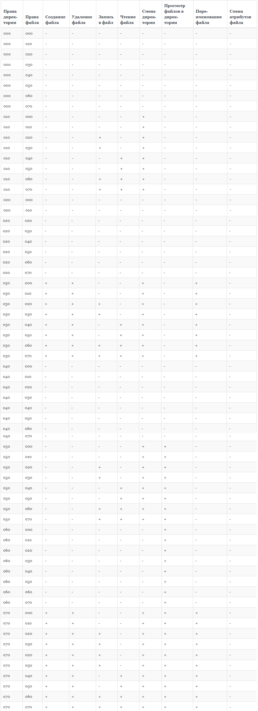

---
## Front matter
lang: ru-RU
title: Лабораторная работа №3
author: Юхнин Илья Андреевич
documentclass: article
papersize: a4
toc: false
slide_level: 2
aspectratio: 20
section-titles: true
##Fonts
fontsize: 12pt
mainfont: PT Serif
romanfont: PT Serif
sansfont: PT Sans
monofont: PT Mono
mainfontoptions: Ligatures=TeX
romanfontoptions: Ligatures=TeX
sansfontoptions: Ligatures=TeX,Scale=MatchLowercase
monofontoptions: Scale=MatchLowercase,Scale=0.9
---

# 
Лабораторная работа №3

**Автор: Юхнин Илья Андреевич**

**Группа: НКНбд-01-19**

## Цель выполнения лабораторной работы

- Получение практических навыков работы в консоли с атрибутами файлов для групп пользователей.

    

    

## Задачи

- Выполнить все пункты работы, занося ответы на поставленные вопросы и замечания в отчёт.

## Результат лабораторной работы

- Таблица 1

- Таблица 2

​    

 Спасибо за внимание!

