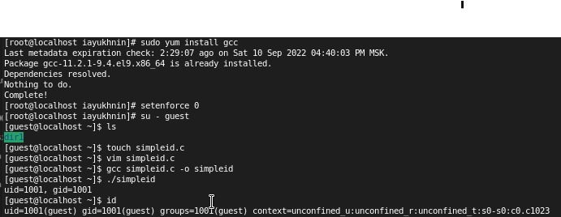
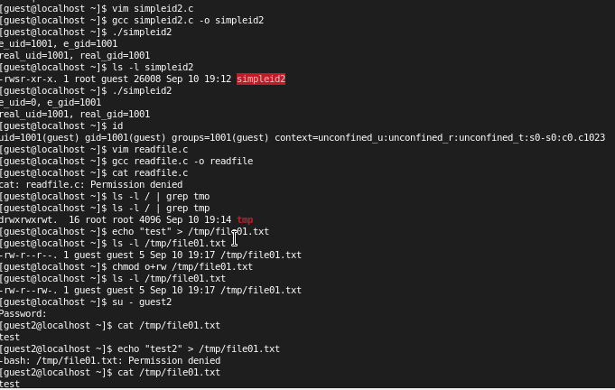
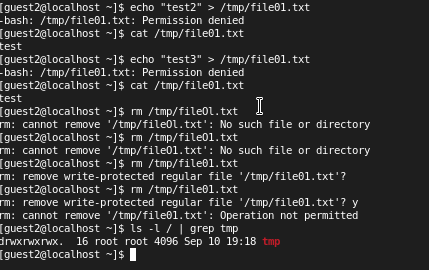
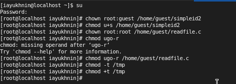

---
# Front matter
lang: ru-Ru
title: "Лабораторная работа №5"
subtitle: "Установка дистрибутива Rocky"
author: "Юхнин Илья Андреевич"

# Formatting
toc-title: "Содержание"
toc: true # Table of contents
toc_depth: 2
lof: true # List of figures
lot: true # List of tables
fontsize: 12pt
linestretch: 1.5
papersize: a4paper
documentclass: scrreprt
polyglossia-lang: russian
polyglossia-otherlangs: english
mainfont: PT Serif
romanfont: PT Serif
sansfont: PT Sans
monofont: PT Mono
mainfontoptions: Ligatures=TeX
romanfontoptions: Ligatures=TeX
sansfontoptions: Ligatures=TeX,Scale=MatchLowercase
monofontoptions: Scale=MatchLowercase
indent: true
pdf-engine: xelatex
header-includes:
  - \linepenalty=10 # the penalty added to the badness of each line within a paragraph (no associated penalty node) Increasing the value makes tex try to have fewer lines in the paragraph.
  - \interlinepenalty=0 # value of the penalty (node) added after each line of a paragraph.
  - \hyphenpenalty=50 # the penalty for line breaking at an automatically inserted hyphen
  - \exhyphenpenalty=50 # the penalty for line breaking at an explicit hyphen
  - \binoppenalty=700 # the penalty for breaking a line at a binary operator
  - \relpenalty=500 # the penalty for breaking a line at a relation
  - \clubpenalty=150 # extra penalty for breaking after first line of a paragraph
  - \widowpenalty=150 # extra penalty for breaking before last line of a paragraph
  - \displaywidowpenalty=50 # extra penalty for breaking before last line before a display math
  - \brokenpenalty=100 # extra penalty for page breaking after a hyphenated line
  - \predisplaypenalty=10000 # penalty for breaking before a display
  - \postdisplaypenalty=0 # penalty for breaking after a display
  - \floatingpenalty = 20000 # penalty for splitting an insertion (can only be split footnote in standard LaTeX)
  - \raggedbottom # or \flushbottom
  - \usepackage{float} # keep figures where there are in the text
  - \floatplacement{figure}{H} # keep figures where there are in the text
---

# Цель работы

Изучение механизмов изменения идентификаторов, применения SetUID- и Sticky-битов. Получение практических навыков работы в консоли с дополнительными атрибутами. Рассмотрение работы механизма смены идентификатора процессов пользователей, а также влияние бита Sticky на запись и удаление файлов.

# Задание

# Выполнение лабораторной работы

Установил gcc с помощью команды `yum install gcc`.
Отменил на текущую сессию SELinux командой `setenforce 0`. Вошёл в систему от имени пользователя guest, создал программу `simpleid.c`.
Скомпилировал программу и убедился, что файл программы создан: `gcc simpleid.c -o simpleid`. Выполнил программу simpleid: `./simpleid`. Выполнил программу `id` и сравнил полученный результат с данными предыдущего пункта задания. Полученные значения id совпадают.
Усложнил программу, добавив вывод действительных идентификаторов, получившуюися программу назвал `simpleid2.c`.
Скомпилировал и запустил simpleid2.c `gcc simpleid2.c -o simpleid2`, а затем `./simpleid2`. 
От имени суперпользователя выполнил команды: `chown root:guest /home/guest/simpleid2`, а затем `chmod u+s /home/guest/simpleid2`. Первая команда изменяет права на файл с guest на root. А затем устанавливает атрибут SetUID, который запускает программу не с правами пользователя, а с правами владельца файла. Затем выполнил  проверку изменений с помощью команды `ls -l simpleid2`.
Запустил simpleid2 и id: `./simpleid2`, `id`. При данном запуску выводы совпадают.
Проделал то же самое с атрибутом SetGID (установление прав для владеющей группы). Запустил файл. Теперь выводы для группы различны.
Создал программу `readfile.c`.
Откомпилировал программу: `gcc readfile.c -o readfile`. Сменил владельца у файла readfile.c и изменил права так, чтобы только суперпользователь(root) мог прочитать его, a guest не мог. Проверил, что пользователь guest не может прочитать файл readfile.с 
Сменил у программы readfile владельца и установил SetU’D-бит. Программа readfile может прочитать файл readfile.c. Программа readfile может прочитать файл /etc/shadow. Исследование Sticky-бита. Узнал, установлен ли атрибут Sticky на директории /tmp, для чего выполнил команду `ls -l / | grep tmp`
От имени пользователя guest создал файл file01.txt в директории /tmp
со словом test `echo "test" > /tmp/file01.txt`. Просмотрел атрибуты у только что созданного файла и разрешил чтение и запись для категории пользователей «все остальные»: `ls -l /tmp/file01.txt`, `chmod o+rw /tmp/file01.txt`, `ls -l /tmp/file01.txt`. От пользователя guest2 (не являющегося владельцем) попробовал прочитать файл /tmp/file01.txt: `cat /tmp/file01.txt`, записать в файл `/tmp/file01.txt` текст test3, стерев при этом всю имеющуюся в файле информацию командой `echo "test3" > /tmp/file01.txt`. Проверил содержимое файла командой `cat /tmp/file01.txt`, попробовал дозаписать в файл `/tmp/file01.txt` слово test2 командой `echo "test2" >> /tmp/file01.txt`, удалить файл /tmp/file01.txt командой `rm /tmp/file01.txt` Файл удалить не удалось. 
Повысил свои права до суперпользователя следующей командой `su -`
и выполнил после этого команду, снимающую атрибут t (Sticky-бит) с
директории /tmp: `chmod -t /tmp`. Затем попробовал выполнить все вышеперечисленные операции. Все удалось. 
Повысил свои права до суперпользователя и вернул атрибут `t` на директорию /tmp: `su -`, `chmod +t /tmp`, `exit`.

# Выводы

Изучил механизмы изменения идентификаторов, применения SetUID- и Sticky-битов. Получил практические навыки работы в консоли с дополнительными атрибутами. Рассмотрел работу механизма смены идентификатора процессов пользователей, а также влияние бита Sticky на запись и удаление файлов.

# Список литературы

- <code>[Лабораторная работа №5](https://esystem.rudn.ru/mod/folder/view.php?id=892013)</code>