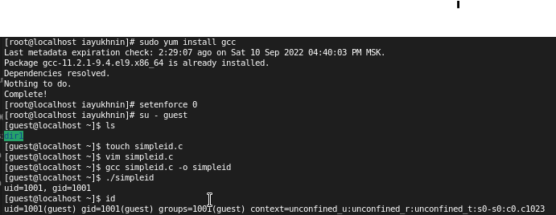
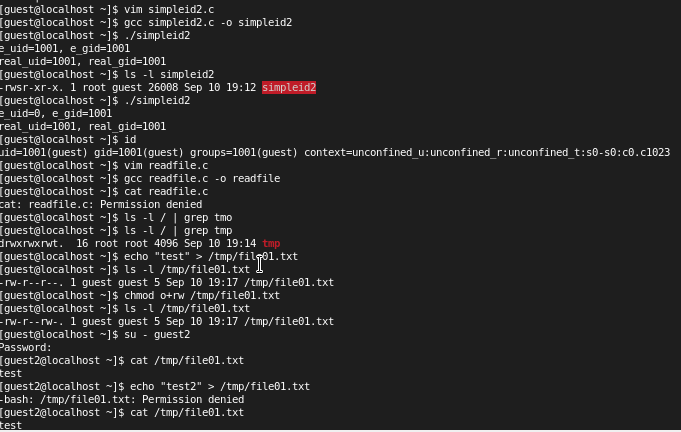

---
## Front matter
lang: ru-RU
title: Лабораторная работа №5
author: Юхнин Илья Андреевич
documentclass: article
papersize: a4
toc: false
slide_level: 2
aspectratio: 20
section-titles: true
##Fonts
fontsize: 12pt
mainfont: PT Serif
romanfont: PT Serif
sansfont: PT Sans
monofont: PT Mono
mainfontoptions: Ligatures=TeX
romanfontoptions: Ligatures=TeX
sansfontoptions: Ligatures=TeX,Scale=MatchLowercase
monofontoptions: Scale=MatchLowercase,Scale=0.9
---

# 
Лабораторная работа №5

**Автор: Юхнин Илья Андреевич**

**Группа: НКНбд-01-19**

## Цель выполнения лабораторной работы

- Изучение механизмов изменения идентификаторов, применения
    SetUID- и Sticky-битов. Получение практических навыков работы в кон-
    соли с дополнительными атрибутами. Рассмотрение работы механизма
    смены идентификатора процессов пользователей, а также влияние бита
    Sticky на запись и удаление файлов.

    

## Выполнение лабораторной работы

- 

## Выводы лабораторной работы

- Изучил механизмы изменения идентификаторов, применения SetUID- и  Sticky-битов. Получил практические навыки работы в консоли с  дополнительными атрибутами. Рассмотрел работу механизма смены  идентификатора процессов пользователей, а также влияние бита Sticky на  запись и удаление файлов.

​    

 Спасибо за внимание!

